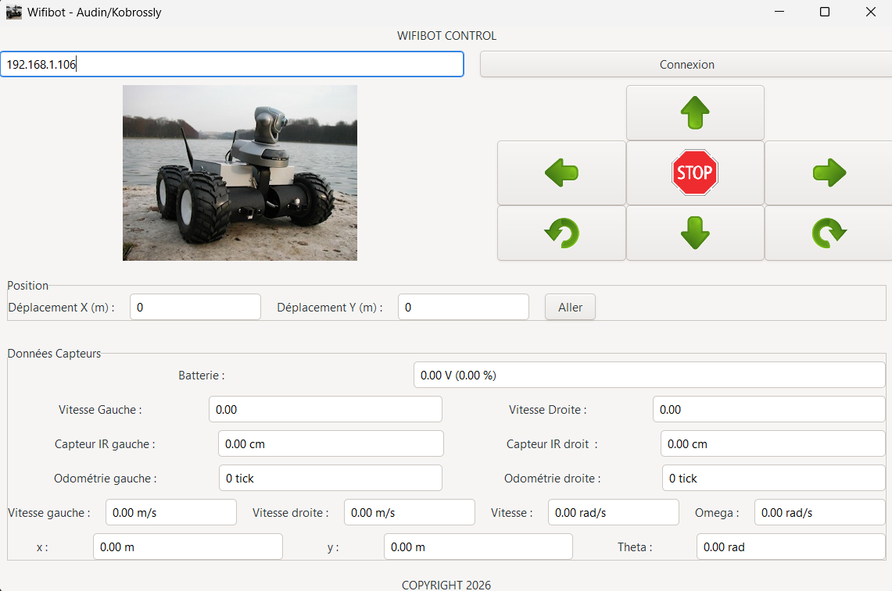

# Wifibot Control Interface

<br>

<p align="center">
  
</p>

<br>

## Description

This project is a C++ control interface for the Wifibot mobile robot. It provides a Graphical User Interface (GUI) to pilot the robot remotely via TCP/IP WiFi connection.

The application allows for manual control of the robot's movement, visualization of real-time sensor data (battery, infrared sensors, wheel speeds), and implements an odometry system to track the robot's position (x, y, theta) relative to its starting point. It also includes a "Go To" feature for basic autonomous displacement to specific coordinates.

Developed as part of the Mobile Robotics course (4A IA2R) at Polytech Nancy.

## Features

* **Remote Control:** Manual piloting (Forward, Backward, Turn Left/Right, Rotate in place) via the GUI.
* **Real-time Telemetry:**
    * Battery voltage monitoring.
    * Infrared distance sensor readings (converted to cm).
    * Wheel velocities and odometry tick counters.
* **Odometry & Kinematics:**
    * Calculation of linear and angular velocities.
    * Real-time position estimation (X, Y, Theta) using differential drive kinematics.
* **Autonomous Navigation:** "Go To" function to move the robot to a target (X, Y) coordinate using a closed-loop control system.
* **Architecture:** Multi-threaded application using `std::thread` to handle non-blocking communication (Send/Receive loops) and GUI updates separately.

## Future Improvements

* **Advanced Localization:** Plan to implement absolute positioning using the infrared sensors via trilateration (intersection of 3 distance circles) coupled with a **Kalman Filter** to fuse sensor data and correct odometry drift over time.
*  **Containerization (Docker):** Plan to containerize the application to standardize the build environment and manage dependencies (Gtkmm, Giomm), ensuring consistent execution across different Linux distributions.
* **Internationalization (i18n):** Implement support for multiple languages (English/French) within the GUI, allowing the interface to adapt based on the user's system locale.

## Prerequisites

To build and run this project, you need a Linux environment with a C++11 compatible compiler and the Gtkmm 3.0 library installed.

### Dependencies
* g++ (supports C++11 standard)
* Make
* gtkmm-3.0
* giomm-2.4 (usually included with gtkmm)

On Ubuntu/Debian systems, you can install the dependencies with:
```bash
sudo apt-get install libgtkmm-3.0-dev
```

## Installation and Compilation

1.  **Clone the repository:**
    ```bash
    git clone https://github.com/KobRayan/wifibot_gui.git
    cd wifibot_gui
    ```

2.  **Compile the project:**
    Use the provided Makefile to build the executable.
    ```bash
    make
    ```
    This will generate an executable file named `client_exe`.

3.  **Clean build files (optional):**
    To remove object files:
    ```bash
    make clean
    ```
    To remove object files and the executable:
    ```bash
    make clean+
    ```

## Usage

1.  **Run the application:**
    ```bash
    ./client_exe
    ```

2.  **Connect to the Robot:**
    * Enter the IP address of the Wifibot in the input field (Default is `192.168.1.106`).
    * Click the **Connexion** button.
    * *Note: Ensure your computer is connected to the same WiFi network as the robot.*

3.  **Control:**
    * Use the arrow buttons on the interface to move the robot.
    * Use the **STOP** button to halt all movement immediately.

4.  **Navigation (Go To):**
    * Enter the desired target coordinates (in meters) relative to the current position in the "Position" frame.
    * Click **Aller** to execute the movement.

## Project Structure

* **main.cpp**: Entry point of the application, initializes the Gtkmm application.
* **gui.cpp / gui.h**: Manages the graphical user interface, widgets, and the update loop (`time_out`).
* **wifibot.cpp / wifibot.h**: Core logic class. Handles the state of the robot, odometry calculations, and movement threads.
* **socket.cpp / socket.h**: Wrapper classes for TCP/UDP socket communication using `giomm`.
* **order.cpp / order.h**: Helper class to format and limit speed commands sent to the robot.
* **Makefile**: Build script configuration.

## Authors

* **Lucas Audin**
* **Rayan Kobrossly**

Polytech Nancy - Université de Lorraine
